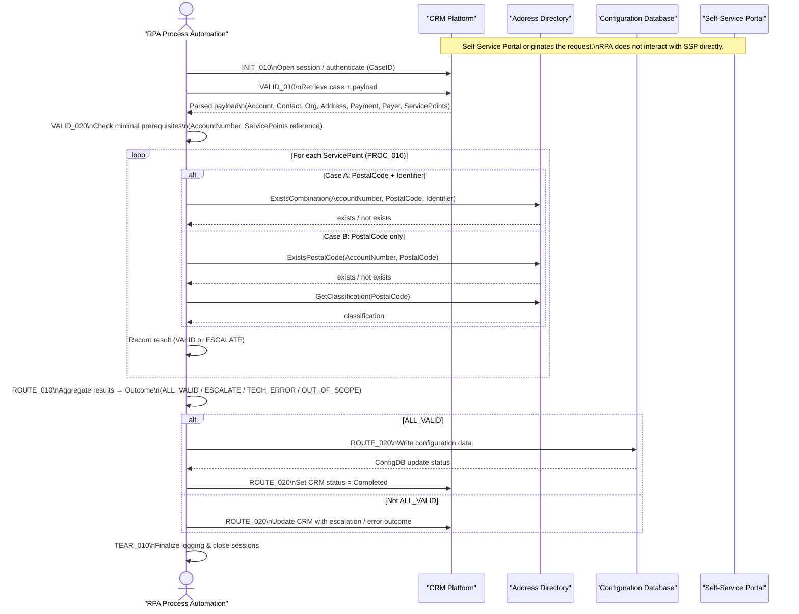

# Business Process Automation Design — Input Worksheet

## 1. Process Context

### Business process name / use case
- Process Self-Service Requests

### Business goal
- automate manual labor
- prepare for peaks

### Trigger
- [ ] Queue item(s) appears  


## 2. Inputs & Outputs

### Primary inputs
- What enters the process: Multiline string with self-service request
- Source location(s): CRM, pointed at by a case id

### Primary outputs
- Required end results:  


## 3. Systems & Access

### Applications involved

```yaml
systems:
  - name: Self-Service Portal
    symbol: "🌐"
    description: "Identifier of the self-service submission channel; origin of payload data, but not directly accessed by automation."
    role: source
    interface: none
    accesstype: tbd
    restrictions: tbd
    notes: "Payload originates here but bot does not interact with it; metadata only."

  - name: CRM Platform
    symbol: "📁"
    description: "Identifier of the CRM/ticketing backend responsible for request lifecycle management."
    role: source_and_target
    interface: api
    accesstype: tbd
    restrictions: tbd
    notes: "Trigger case ID comes from CRM; CRM queried for payload; CRM updated for completion or error handover."

  - name: Address Directory
    symbol: "🗺️"
    description: "Identifier of the authoritative address-validation backend used during normalization."
    role: enrichment
    interface: api
    accesstype: tbd
    restrictions: tbd
    notes: "Used only for lookup and validation; no write operations."

  - name: Configuration Database
    symbol: "🗄️"
    description: "Identifier of the configuration/CMDB backend providing validated reference data."
    role: target
    interface: database
    accesstype: tbd
    restrictions: tbd
    notes: "Primary destination for normalized payload data."

  - name: RPA Process Automation
    symbol: "🤖"
    description: "Identifier of the automation bot/process providing deterministic cross-system execution."
    role: orchestration
    interface: none
    accesstype: tbd
    restrictions: tbd
    notes: "No business data; only executes logic and coordinates systems."

```

### Credentials / identity
- Robot vs personal user:
- MFA / SSO notes:  


## 4. Happy Path (Human Perspective)

### Main steps (ideal case, high level)

### Technical functional perspective

| Step ID   | Description                                                                                                                                       | Data Input                                                             | Data Output                                                 | Screenshot | Next Step |
| --------- | ------------------------------------------------------------------------------------------------------------------------------------------------- | ---------------------------------------------------------------------- | ----------------------------------------------------------- | ---------- | --------- |
| INIT_010  | Initialize process: receive CRM Case ID, create runtime context (correlation/logging), open/authenticate CRM session.                             | CaseID                                                                 | RuntimeContext, CRMSession                                  | 📁🤖         | VALID_010 |
| VALID_010 | Retrieve CRM case; verify scope; parse payload into internal data model (account, contact, organization, address, payment, payer, servicepoints). | CaseID, CRMSession                                                     | ParsedDataModel (all groups), CaseScopeStatus               | 📁🤖         | VALID_020 |
| VALID_020 | Validate that required trigger-tier inputs for servicepoint validation are present (minimally AccountNumber + ServicePoints reference).           | ParsedDataModel                                                        | ValidationPrereqStatus (OK / MissingRequiredInput)          | 🤖          | PROC_010  |
| PROC_010  | For all eligible servicepoints: apply A/B rules using Address Directory; produce per-item result (VALID / ESCALATE + reason).                     | AccountNumber, ServicePoints, AddressDirectory                         | ServicePointResults[] (VALID / ESCALATE + reason)           | 🤖🗺️         | ROUTE_010 |
| ROUTE_010 | Aggregate all servicepoint results + technical outcomes into overall outcome (ALL_VALID, BUSINESS_ESCALATE, TECH_ERROR, OUT_OF_SCOPE).            | ServicePointResults[], CaseScopeStatus, ValidationPrereqStatus         | Outcome                                                     | 🤖          | ROUTE_020 |
| ROUTE_020 | Outcome-specific actions: if ALL_VALID → write configuration to Config DB; else → update CRM with escalation / error metadata only.               | Outcome, ParsedDataModel, CRMSession, ConfigurationDatabase            | CRMUpdateStatus, ConfigDBUpdateStatus (only when ALL_VALID) | 📁🗄️         | TEAR_010  |
| TEAR_010  | Teardown: close CRM / Address Directory / Configuration DB sessions; finalize logging and audit; end process instance.                            | CRMSession, AddressDirectorySession?, ConfigDBSession?, RuntimeContext | ClosedSessions, FinalLogRecord                              | 📁🗺️🗄️🤖       | END       |



| Step ID   | Description                                                                                                                   | Screenshot | Next Step             |
| --------- | ----------------------------------------------------------------------------------------------------------------------------- | ---------- | --------------------- |
| INIT_010  | Receive trigger input containing CRM Case ID.                                                                                 | 📁          | INIT_020              |
| INIT_020  | Open CRM Platform UI or establish CRM API/session using robot credentials.                                                    | 📁          | VALID_010             |
| VALID_010 | Retrieve CRM case by Case ID.                                                                                                 | 📁          | VALID_020             |
| VALID_020 | Validate case status/type is in scope (not closed/cancelled/out-of-scope).                                                    | 📁          | VALID_030 / PROC_910  |
| VALID_030 | Parse CRM payload into internal data model groups (account, contact, organization, address, payment, payer, servicepoints).   | 📁          | VALID_040             |
| VALID_040 | Validate presence of all mandatory trigger-tier fields according to schema (no semantic checks yet).                          | 🤖          | VALID_050 / PROC_920  |
| VALID_050 | Validate basic field formats (email, phone, IBAN, postal code, dates) according to schema/regex rules.                        | 🤖          | PROC_010 / PROC_920   |
| PROC_010  | Associate case with internal customer context (account/contact/organization/payer) in CRM.                                    | 📁          | PROC_015              |
| PROC_015  | Open Address Directory UI or establish Address Directory API/session.                                                         | 🗺️          | PROC_020              |
| PROC_020  | Initialize iteration over all servicepoints in the payload.                                                                   | 🤖          | PROC_030              |
| PROC_030  | For current servicepoint, determine validation case: A (PostalCode + Identifier) or B (PostalCode only).                      | 🤖          | PROC_040A / PROC_040B |
| PROC_040A | Case A: Call Address Directory to validate existence of PostalCode + Identifier combination (Rule R1).                        | 🗺️          | PROC_060 / PROC_930   |
| PROC_040B | Case B: Call Address Directory to validate PostalCode exists (Rule R2) and classification is allowed (Rule R3).               | 🗺️          | PROC_060 / PROC_930   |
| PROC_060  | Mark current servicepoint as VALID or INVALID; append to corresponding result collection.                                     | 🤖          | PROC_070              |
| PROC_070  | Check if additional servicepoints remain in the list.                                                                         | 🤖          | PROC_020 / PROC_080   |
| PROC_080  | Derive overall validation outcome (all VALID vs. at least one INVALID).                                                       | 🤖          | PROC_090              |
| PROC_090  | Write configuration record into Configuration Database (validated servicepoints, payment schedule/method, options, metadata). | 🗄️          | PROC_100 / PROC_930   |
| PROC_100  | Update CRM case: set final status (Completed if all VALID; Requires Manual Review if any INVALID or validation error).        | 📁          | TEAR_010              |
| PROC_910  | Handle out-of-scope or ineligible case: log reason, update CRM with non-processable status, skip configuration.               | 📁          | TEAR_010              |
| PROC_920  | Handle validation failure (missing/invalid mandatory data): log details, update CRM to request manual correction.             | 📁          | TEAR_010              |
| PROC_930  | Handle technical error during external calls: apply retry policy; if still failing, mark CRM case as Technical Error.         | 🤖          | TEAR_010              |
| TEAR_010  | Gracefully close or sign out of CRM, Address Directory, and Configuration Database sessions/applications.                     | 📁🗺️🗄️        | TEAR_020              |
| TEAR_020  | Finalize logging and audit trail (outcome, timestamps, error codes, counts); release resources.                               | 🤖          | TEAR_030              |
| TEAR_030  | End of process instance.                                                                                                      | 🤖          |                       |

## 5. Rules & Decisions

### Business rules / decision logic

#### Scope

Validate each item in `ServicePoints` against the Address Directory and classification rules, then decide **VALID** vs. **ESCALATE**.

#### Inputs (per item)

- `ServicePoint.Enabled` *(optional boolean)*
- `ServicePoint.PostalCode` *(string, required for any validation)*
- `ServicePoint.Identifier` *(string, optional; when present, triggers combination check)*
- `ServicePoint.Type` *(string, optional, informational)*
- `ServicePoint.City` *(string, optional, informational)*
- `AccountNumber` *(string; customer/account reference used in cross-checks)*

#### Core Rules (with IDs)

**R0 — Skip Disabled Items**
- **Condition:** `ServicePoint.Enabled == false`
- **Outcome:** **Skip** validation for this item (no result recorded).

**R1 — Mandatory PostalCode**
- **Condition:** `Present(ServicePoint.PostalCode)` must be **true**.
- **Outcome:** If missing → **ESCALATE (MissingPostalCode)**.

**R2 — Combination Exists (PostalCode + Identifier)** *(applies when Identifier is provided)*
- **Condition:** `Present(ServicePoint.Identifier)` **AND** `ExistsCombination(AccountNumber, PostalCode, Identifier)`
- **Outcome:**
    - **true → VALID**
    - **false → ESCALATE (CombinationNotFound)**

**R3 — PostalCode Exists (only PostalCode provided)**
- **Condition:** `NOT Present(ServicePoint.Identifier)` **AND** `ExistsPostalCode(AccountNumber, PostalCode)`
- **Outcome:**
    - **true → proceed to R4**
    - **false → ESCALATE (PostalCodeNotFound)**

**R4 — Classification Valid**
- **Condition:** `GetClassification(PostalCode) ∈ {LARGE_RECIPIENT, CAMPAIGN}`
- **Outcome:**
    - **true → VALID**
    - **false → ESCALATE (InvalidClassification)**

#### Decision Flow (compact)

```text
For each ServicePoint:
  IF Enabled == false → SKIP
  IF PostalCode missing → ESCALATE: MissingPostalCode
  IF Identifier present:
      IF ExistsCombination(AccountNumber, PostalCode, Identifier) → VALID
      ELSE → ESCALATE: CombinationNotFound
  ELSE:
      IF ExistsPostalCode(AccountNumber, PostalCode) == false → ESCALATE: PostalCodeNotFound
      ELSE IF Classification ∈ {LARGE_RECIPIENT, CAMPAIGN} → VALID
      ELSE → ESCALATE: InvalidClassification
```

#### Outcomes

- **VALID**: Item is accepted; include in configuration persistence.
- **ESCALATE**: Route item for human review (no persistence until resolved).

#### Post-Validation Actions

- Aggregate **VALID** items for downstream configuration (e.g., `PostalCode`, `Identifier`, `Type`, `City`).
- Log reasons for **ESCALATE** per item to enable targeted remediation.

## 6. Exceptions & Edge Cases

### Human handover conditions

#### Input Completeness & Format

**Missing PostalCode**
- Trigger: `PostalCode` absent or empty.
- Action: **ESCALATE (MissingPostalCode)**.

**Identifier Provided but Malformed**
- Trigger: `Identifier` present but fails format validation (optional implementation).
- Action: **ESCALATE (IdentifierInvalidFormat)** *(if you enforce a format)*.

**PostalCode Format Invalid**
- Trigger: PostalCode fails pattern/range checks (e.g., country-specific constraints).
- Action: **ESCALATE (PostalCodeInvalidFormat)** *(if enforced)*.

#### Referential Checks

**Combination Not Found**
- Trigger: `ExistsCombination(...) == false` when Identifier is present.
- Action: **ESCALATE (CombinationNotFound)**.

**PostalCode Not Found**
- Trigger: `ExistsPostalCode(...) == false` when Identifier is absent.
- Action: **ESCALATE (PostalCodeNotFound)**.

**Unknown Classification**
- Trigger: `GetClassification(...)` returns null/unknown.
- Action: **ESCALATE (ClassificationUnknown)** *(optional distinct reason)*.

**Invalid Classification**
- Trigger: Classification **not** in `{LARGE_RECIPIENT, CAMPAIGN}`.
- Action: **ESCALATE (InvalidClassification)**.

#### Collection Semantics

**Disabled Items**
- Trigger: `Enabled == false`.
- Action: **SKIP** item (no validation, no persistence).

**Duplicate Items**
- Trigger: Two or more items with identical `(PostalCode, Identifier)` pairs.
- Action:
    - Either **deduplicate** (keep first VALID, mark duplicates as **ESCALATE (DuplicateEntry)**),
    - Or **allow duplicates** if explicitly required; define policy in PRD.

**Conflicting Items**
- Trigger: Same `PostalCode` with different `Identifier` entries where only one validates.
- Action: Accept the **VALID** one(s); **ESCALATE** the failing one(s) with their specific reasons.

### Error handling preferences

**Address Directory Unavailable / Timeout**
- Trigger: External lookup fails, times out, or returns error.
- Action: **ESCALATE (DirectoryUnavailable)**; optionally **retry** with backoff.

**Partial Data from Directory**
- Trigger: ExistsPostalCode returns true but classification feed is missing.
- Action: **ESCALATE (ClassificationUnknown)** or **retry**.

## 7. Non-Functional Constraints

### Volumes & timing
- Volume:
- Peaks:
- SLAs:

### Environments
- Dev/Test/Prod notes:

## 8. Existing Artefacts

### Already available
- [ ] Existing UiPath workflow(s)
- [ ] BPMN / diagram
- [ ] Excel / Word docs
- [ ] Notes only
